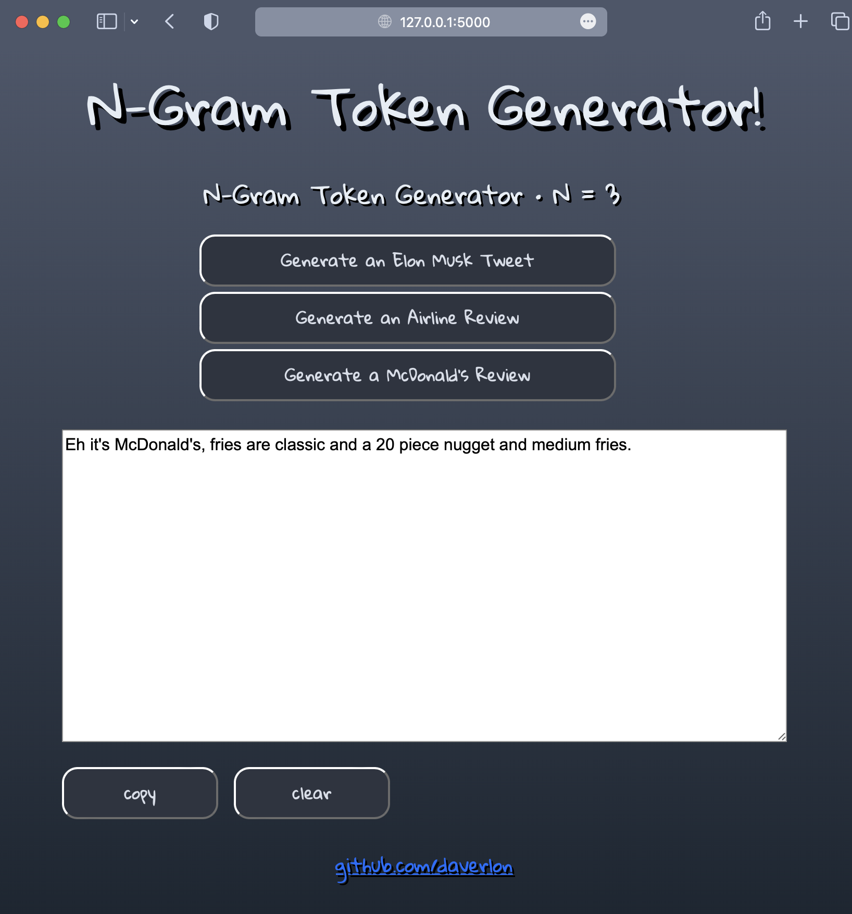

<h1>N-Gram Text Generator</h1>

Word<i>(token)</i> generator based on N-Gram statistics. This application has three separate uses of the same N-Gram model, trained on:

<ul>
<li>Elon Musk Tweets (2021)</li>
<li>Airline Reviews</li>
<li>McDonald's Reviews</li>
</ul>

<i>Sourced from Kaggle.com</i>

Python Requirements:

<ul>
<li>numpy</li>
<li>tqdm</li>
<li>flask</li>
</ul>
 

To run the app <i>(in project root folder):</i>

<pre>
flask --app app run
</pre>

Preview:

 
